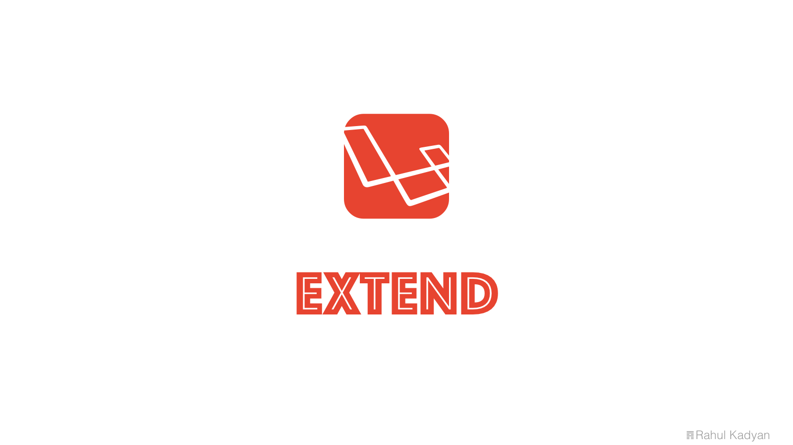

# extend

This is where your description should go. Try and limit it to a paragraph or two, and maybe throw in a mention of what
PSRs you support to avoid any confusion with users and contributors.



<p align="center">
  <a href="https://styleci.io/repos/">
    
  </a>
  <a href="https://circleci.com/gh/znck/extend">
    
  </a>
  <a href="https://coveralls.io/github/znck/extend?branch=master">
    
  </a>
  <a href="LICENSE">
    
  </a>
  <a href="https://packagist.org/packages/znck/extend">
    
  </a>
  <a href="https://github.com/znck/extend/releases">
    
  </a>

  <a href="https://github.com/znck/extend/issues">
    
  </a>
</p>

## Install

Via Composer

``` bash
$ composer require znck/extend
```

## Usage

``` php
$skeleton = new League\Skeleton();
echo $skeleton->echoPhrase('Hello, League!');
```

## Change log

Please see [CHANGELOG](CHANGELOG.md) for more information what has changed recently.

## Testing

``` bash
$ composer test
```

## Contributing

Please see [CONTRIBUTING](CONTRIBUTING.md) and [CONDUCT](CONDUCT.md) for details.

## Security

If you discover any security related issues, please email hi@znck.me instead of using the issue tracker.

## Credits

- [Rahul Kadyan][link-author]
- [All Contributors][link-contributors]

## License

The MIT License (MIT). Please see [License File](LICENSE.md) for more information.

[link-author]: https://github.com/znck
[link-contributors]: ../../contributors
